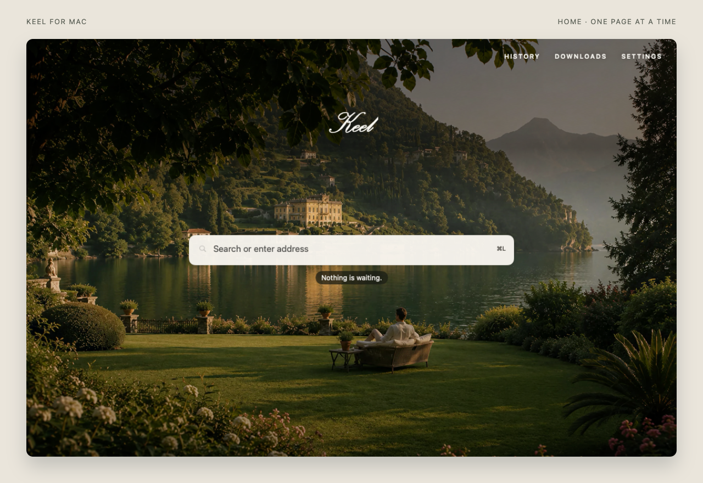
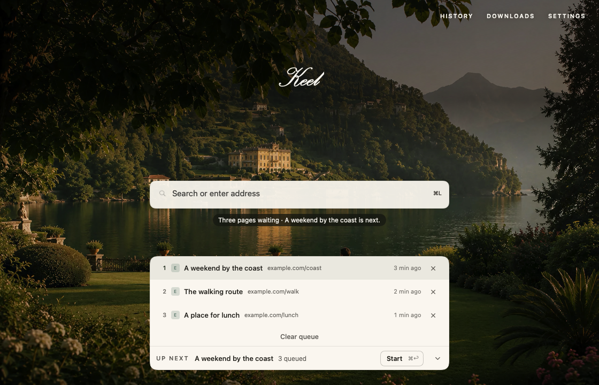

  

<h1 align="center">Keel</h1>

<strong>A macOS browser with one page at a time.</strong>

Keel is a native, tabless web browser for Mac. Open one page, queue links for later, and finish what you are reading. Keel opens the next destination when you close the current page. Queued websites stay unloaded until their turn.

  <a href="#try-keel">Try Keel</a> ·
  <a href="#how-keel-works">How it works</a> ·
  <a href="#questions-before-you-switch">Common questions</a> ·
  <a href="https://github.com/rowesk/Keel">Star on GitHub</a>

macOS 26+ · Apple silicon tested · Pre-release

## Keep the link. Finish the page.

An article links to another article. A message brings a walking route. You want to keep both without leaving the page you are on.

Cmd-click puts a link at the end of Keel's queue. The current page stays put. When you finish, Cmd+W opens the oldest waiting destination. When nothing is waiting, you return to Home.

No tab strip to manage. No timer to start. No task to name before you can browse.

## How Keel works

| You do this | Keel does this |
| --- | --- |
| Open an address or search | Loads it in the single active page. |
| Cmd-click a link | Keeps the destination for later without loading it. |
| Finish with Cmd+W | Closes the page and opens the next queued destination, or Home if the queue is empty. |
| Open Home | Shows the queue so you can remove links you no longer need. Home does not finish the active page. |
| Undo close | Restores the most recently closed page while it remains available. |

The queue follows arrival order. You can prune it, but you cannot reorder it or use it as a tab switcher. Explicitly opening an address still lets you go somewhere immediately.

<picture>
  <source media="(prefers-color-scheme: dark)" srcset="docs/media/queue-dark.png">
  
</picture>

*Current app views, rendered offscreen with fictional example.com links. The queue supports light and dark appearance.*

## Try Keel

Keel is in pre-release development. There is no public app download yet. The signed, notarized installer is still being prepared.

Developers with **macOS 26 or later, Swift 6.2 or later, and an Apple Development signing certificate** can [build Keel from source](docs/building.md). Apple silicon has been tested. Intel support has not been verified.

If you want the app rather than a development setup, star this repository to keep it handy. Once releases are available, GitHub's **Watch → Custom → Releases** setting can notify you about new versions.

## The shortcuts you will use

| Action | Shortcut |
| --- | --- |
| Address or search | Cmd+L |
| Queue the address you are typing | Cmd+Return in the address field |
| Queue the current URL | Cmd+D |
| Finish the current page | Cmd+W |
| Put the current URL at the back and finish | Option+Cmd+W |
| Undo close | Shift+Cmd+T |
| Show Home | Shift+Cmd+H |
| Start the queue from Home | Cmd+Return outside the address field |
| History | Cmd+Y |
| Downloads | Option+Cmd+L |

The Help menu contains the full shortcut list. Cmd+T opens the address field; it does not create another tab.

## Questions before you switch

### Is Keel a browser or an extension?

Keel is a standalone macOS browser built with Swift, AppKit, SwiftUI, WebKit, and SQLite. It has its own local browsing profile. It does not install into Safari or Chrome, and it does not currently support browser extensions.

### Is the queue a reading list?

It is a temporary queue of URLs. Destinations expire after 72 hours by default. Settings also offers 24 hours or seven days. A queued destination does not preserve a form, scroll position, or running website. Use another tool for permanent bookmarks.

### What happens when I close a page or quit Keel?

Keel can keep one closed page ready for Undo for ten minutes. Closing another page replaces it, and quitting clears it. After relaunch, Keel opens Home and can offer to resume unfinished browsing. Resume is not a guarantee that a website's unsaved form or application state will survive. Save important work on the website first.

### Does one page mean less memory use?

Queued destinations have no loaded web pages. That avoids background page work for those links. The active website, WebKit processes, and the optional retained Undo page still use memory. Keel does not claim a measured advantage over another browser.

### What works, and what is still missing?

Keel includes local History, downloads, find in page, search-provider settings, and custom Home photos. It supports temporary page-owned windows for flows such as sign-in, but real-site compatibility testing is ongoing.

There is no extension support, cross-device sync, private browsing mode, built-in ad blocker, or password manager. Website notifications are disabled. Camera, microphone, location, and screen-sharing access are unavailable. Keep your existing browser for workflows that need those capabilities.

### Does Keel collect browsing data?

Keel keeps History, queue entries, settings, and recovery data on your Mac. It sends no Keel telemetry or automatic crash reports. Websites, search providers, and favicon requests still use the network. Keel is not an anonymity tool. Read [privacy and local data](docs/privacy.md) for the details.

## Help shape Keel

Try a workflow you use every day and [report what breaks](https://github.com/rowesk/Keel/issues). Include your macOS version, Keel build, and steps we can reproduce with a public page or fictional data. Please keep account details and browsing history out of public reports.

Code contributions should preserve one ordinary page and an unloaded queue. Start with the [contribution guide](CONTRIBUTING.md) and [build instructions](docs/building.md).

Created by [Chris Rowe](https://github.com/rowesk).

Keel's code is available under the [MIT licence](LICENSE). Image credits and separate asset terms are listed in [third-party notices](THIRD_PARTY_NOTICES.md).
